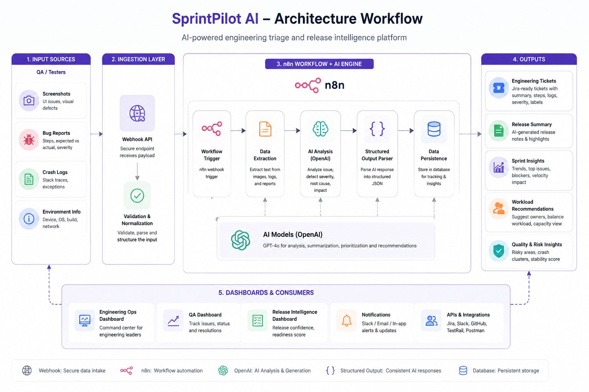
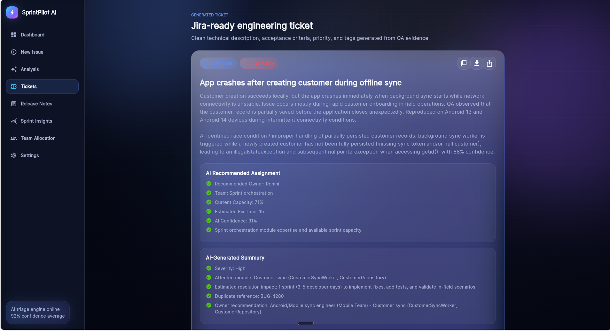
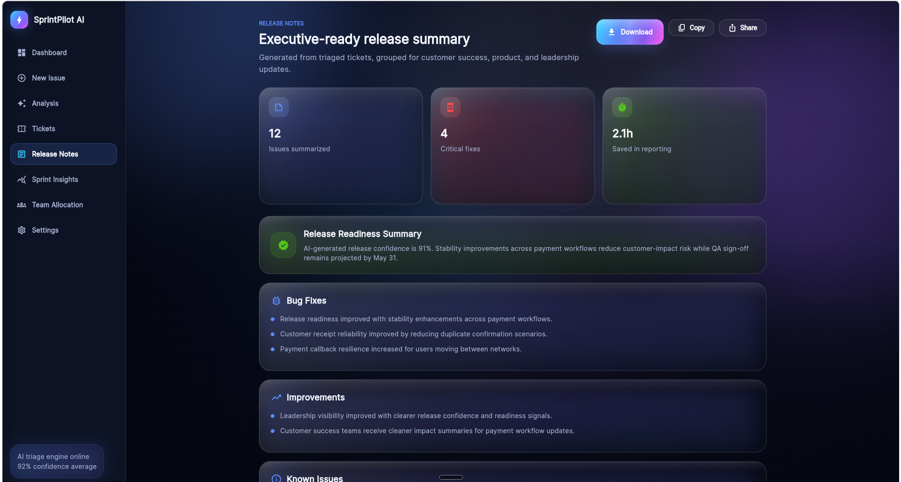
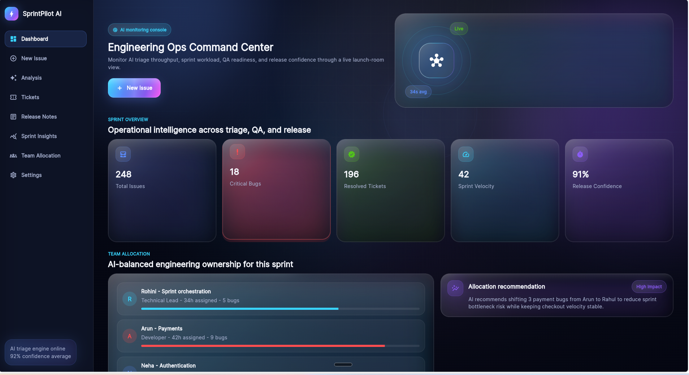

# SprintPilot AI Triage

AI-powered engineering triage and release intelligence platform built with Flutter, n8n, and OpenAI.

SprintPilot AI transforms QA evidence, crash logs, screenshots, and bug reports into structured engineering insights including Jira-ready tickets, release summaries, sprint intelligence, and workload recommendations using automated AI workflows.

---

## Features

- AI-powered bug triage
- Screenshot and crash log analysis
- Jira-ready engineering ticket generation
- AI-generated release summaries
- Sprint insights and release confidence analysis
- Team workload and ownership recommendations
- n8n workflow automation
- Structured AI output parsing
- Postman API integration
- Flutter-based modern dashboard UI

---

## Tech Stack

### Frontend
- Flutter
- Dart

### Automation & Backend
- n8n
- Webhooks
- Structured Output Parser

### AI
- OpenAI GPT
- AI Agents
- Prompt Engineering

### Tools
- Postman
- GitHub

---

## Architecture Overview

SprintPilot AI follows an AI-driven workflow pipeline:

1. QA uploads screenshot and bug details
2. Request sent through webhook
3. AI agent analyzes issue severity and root cause
4. Structured engineering response generated
5. Ticket and release insights created automatically
6. Sprint intelligence and workload recommendations generated

---

## Workflow Diagram



---

## Screenshots

### AI Analysis


### AI Ticket Generation


### QA Upload Screen


### Release Intelligence


### Engineering Ops Dashboard


---

## API Example

### Webhook Endpoint

```http
POST /webhook/triage
```

### Sample Request

```json
{
  "project": "SprintPilot Mobile CRM",
  "platform": "android",
  "priority": "high",
  "issueTitle": "App crashes after creating customer during offline sync"
}
```

---

## n8n Workflow

The project uses n8n automation workflows for:
- AI triage orchestration
- Structured output parsing
- Release note generation
- Sprint analytics
- Ticket generation workflows

---

## Project Structure

```bash
lib/
 ├── screens/
 ├── widgets/
 ├── models/
 ├── services/
 ├── providers/
 └── utils/
```

---

## Setup Instructions

### Flutter

```bash
flutter pub get
flutter run
```

### n8n

1. Import workflow JSON
2. Configure webhook endpoint
3. Add OpenAI credentials
4. Execute workflow

---

## Demo

### Live Demo
Add your deployed URL here

### Demo Video
Add your video URL here

---

## Future Improvements

- Jira integration
- Slack notifications
- GitHub issue sync
- Multi-project analytics
- Real-time collaboration
- AI-based regression prediction

---

## License

MIT License

---

## Author

Rohini